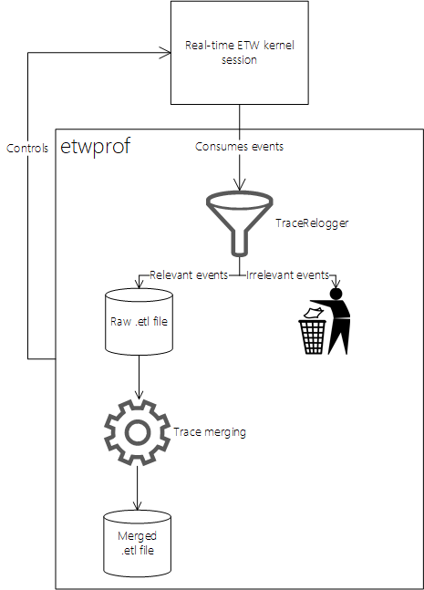

Theory of operation
==========

If you don't know what ETW is or how it works, I can thoroughly recommend Doug E. Cook's [ETW Overview](https://blogs.msdn.microsoft.com/dcook/2015/09/30/etw-overview/).

This is what happens when you ask etwprof to take a sample of a process (super roughly):

1. A real-time ETW kernel session is created. It's configured to produce sampled profile data (amongst other things like module loads/unloads, thread creation/destruction, etc.).
1. A [`TraceRelogger`](https://msdn.microsoft.com/en-us/library/windows/desktop/hh706657(v=vs.85).aspx) instance is created. The kernel ETW session is "redirected" into this relogger instance. The relogger instance is instructed to write its output to a file (`.etl`).
1. Since the kernel ETW session will produce events globally (for every thread/process on the system), filtering is required. This is the core of etwprof's functionality. Filtering is done by examining each event (properties such as provider ID, thread ID, etc.) that passes through the relogger, and retaining/discarding it based on whether it's relevant or not (this logic is contained in [ProfilerCommon.cpp](../Sources/etwprof/Profiler/ProfilerCommon.cpp), if you'd like to have a look).
1. After the session ends (`CTRL+C` is pressed, or the target process exits), so-called trace merging is performed on the result `.etl` file. The kernel providers do not emit metadata that enables tools to symbolize call stacks contained in the trace (e.g. RSDS GUIDs and ages to match PDBs with binaries). This information is added after profiling ends, with the help of a redistributable DLL from the Windows SDK, `kerneltracecontrol.dll`.

  

