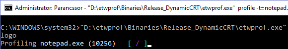

etwprof
==========

etwprof is a lightweight, self-contained sampling profiler for native applications on Windows. It's based on the [Event Tracing for Windows](https://msdn.microsoft.com/en-us/library/windows/desktop/bb968803(v=vs.85).aspx) (ETW) framework.

This profiler has the following design goals:
* No installable dependencies of any sort
* Lightweight
* Processor architecture and model independent
* It must be viable to be used as a technical support tool

Unlike Microsoft provided ETW-based performance profilers (such as [xperf](https://docs.microsoft.com/en-us/previous-versions/windows/it-pro/windows-8.1-and-8/hh162920(v=win.10)), [Windows Performance Recorder](https://docs.microsoft.com/en-us/windows-hardware/test/wpt/windows-performance-recorder), etc.), etwprof performs filtering, so sampled profile data relevant only to the target process is saved. This results in much smaller `.etl` output files compared to other ETW-based tools.

Usage
----------

etwprof is a command line tool. To profile a (already running) process, launch etwprof as an Administrator, and pass either the PID or the name of the executable that you'd like to profile. The following example will profile `notepad.exe`, write the resulting `.etl` file to the user's home folder, and will also create one minidump at the beginning:

`etwprof profile -t=notepad.exe --outdir=%USERPROFILE% -m`

While profiling is in progress, you should see a colorful, spinning progress indicator:

Profiling stops either when you stop it explicitly by pressing `CTRL+C`, or when the target process exits.

The resulting `.etl` file can be opened with a tool of your choice, such as [Windows Performance Analyzer](https://docs.microsoft.com/en-us/windows-hardware/test/wpt/windows-performance-analyzer). If you open the trace with WPA, there's a small quirk: CPU usage not belonging to the target process will show up attributed to "Unknown (0)". This can be worked around easily with filtering:

For a list of command line options and more examples, see the dedicated documentation page about [Usage](Documentation/Usage.md). If you have any questions, please consult the [FAQ](Documentation/FAQ.md) page first.

System requirements
----------

etwprof requires no 3rd party installations (no Visual Studio redistributable, no Windows SDK, etc.).

At least Windows 7 is required for this program to operate. On Windows 7 specifically, etwprof will not work if the system is out of date (an update package is required that was released in 2013). There are individual features that might be unavailable or 
ed on certain OS versions, see [Limitations and known issues](Documentation/Limitations_known_issues.md) for details.

Only 64-bit OSes are supported at this time (profiling of 32-bit *processes* a.k.a. Wow64 is supported, however).

Download
------------

The latest version of etwprof is __0.1__ (released 2018-06-11). Binary distributions are available:
* [Release version](https://poprcdn.blob.core.windows.net/cdn/etwprof/0.1/etwprof_0.1_release.zip)
* [Debug version](https://poprcdn.blob.core.windows.net/cdn/etwprof/0.1/etwprof_0.1_debug.zip)

For previous versions, see [Releases](Documentation/Releases.md). For a list of fixes and improvements, check [Changelog.txt](Misc/Changelog.txt).

Documentation
------------

More detailed documentation is available in the "Documentation" folder:
* [Building](Documentation/Building.md)
* [FAQ](Documentation/FAQ.md)
* [Limitations and known issues](Documentation/Limitations_known_issues.md)
* [Releases](Documentation/Releases.md)
* [Theory of operation](Documentation/Theory_of_operation.md)
* [Troubleshooting](Documentation/Troubleshooting.md)
* [Usage](Documentation/Usage.md)

License
------------

This project is released under the MIT License. Please see "LICENSE.txt" for details.